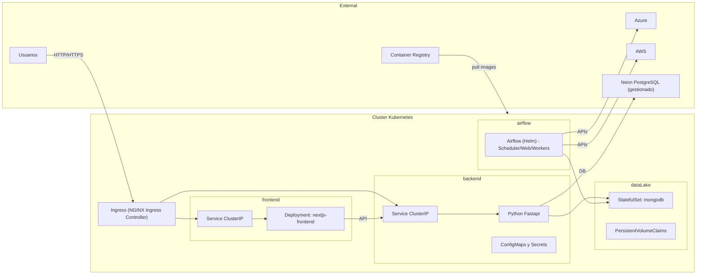

```mermaid

graph LR
  subgraph External
    User["Usuarios"]
    ACR["Container Registry"]
    AzureAPI["Azure"]
    AWSAPI["AWS"]
    NeonDB["Neon PostgreSQL (gestionado)"]
  end

  subgraph K8sCluster["Cluster Kubernetes"]
    ING["Ingress (NGINX Ingress Controller)"]

    subgraph FrontNS["frontend"]
      FE_DEP["Deployment: nextjs-frontend"]
      FE_SVC["Service ClusterIP"]
    end

    subgraph BackendNS["backend"]
      BE_DEP["Python Fastapi"]
      BE_SVC["Service ClusterIP"]
      BE_CFG["ConfigMaps y Secrets"]
    end

    subgraph DataNS["dataLake"]
      MONGO_SS["StatefulSet: mongodb"]
      MONGO_PVC["PersistentVolumeClaims"]
    end

    subgraph AirflowNS["airflow"]
      AF["Airflow (Helm) - Scheduler/Web/Workers"]
    end


    User -->|HTTP/HTTPS| ING
    ING --> FE_SVC
    ING --> BE_SVC
    FE_SVC --> FE_DEP
    FE_DEP -->|API| BE_SVC
    BE_SVC --> BE_DEP
    BE_DEP --> MONGO_SS
    BE_DEP -->|DB| NeonDB
    AF --> MONGO_SS
    AF -->|APIs| AzureAPI
    AF -->|APIs| AWSAPI
  end

  ACR -->|pull images| K8sCluster

```

