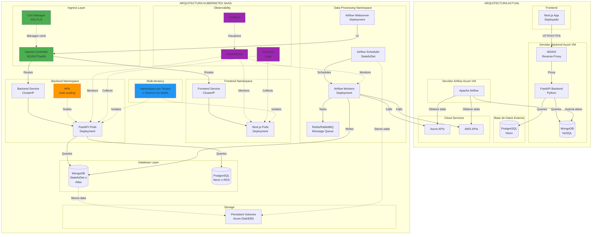

```mermaid
graph TB
    subgraph "ARQUITECTURA ACTUAL"
        subgraph "Frontend"
            A[Next.js App<br/>Deployado]
        end
        
        subgraph "Servidor Backend Azure VM"
            B[NGINX<br/>Reverse Proxy]
            C[FastAPI Backend<br/>Python]
            D[(MongoDB<br/>NoSQL)]
        end
        
        subgraph "Servidor Airflow Azure VM"
            E[Apache Airflow]
        end
        
        subgraph "Base de Datos Externa"
            F[(PostgreSQL<br/>Neon)]
        end
        
        subgraph "Cloud Services"
            G[Azure APIs]
            H[AWS APIs]
        end
        
        A -->|HTTP/HTTPS| B
        B -->|Proxy| C
        C -->|Queries| D
        C -->|Queries| F
        E -->|Inyecta datos| D
        E -->|Obtiene stats| G
        E -->|Obtiene stats| H
    end
    
    subgraph "ARQUITECTURA KUBERNETES SAAS"
        subgraph "Ingress Layer"
            I[Ingress Controller<br/>NGINX/Traefik]
            J[Cert Manager<br/>SSL/TLS]
        end
        
        subgraph "Frontend Namespace"
            K[Next.js Pods<br/>Deployment]
            L[Frontend Service<br/>ClusterIP]
        end
        
        subgraph "Backend Namespace"
            M[FastAPI Pods<br/>Deployment]
            N[Backend Service<br/>ClusterIP]
            O[HPA<br/>Auto-scaling]
        end
        
        subgraph "Data Processing Namespace"
            P[Airflow Scheduler<br/>StatefulSet]
            Q[Airflow Workers<br/>Deployment]
            R[Airflow Webserver<br/>Deployment]
            S[Redis/RabbitMQ<br/>Message Queue]
        end
        
        subgraph "Database Layer"
            T[(MongoDB<br/>StatefulSet o<br/>Atlas)]
            U[(PostgreSQL<br/>Neon o RDS)]
        end
        
        subgraph "Observability"
            V[Prometheus]
            W[Grafana]
            X[ELK/Loki<br/>Logs]
        end
        
        subgraph "Storage"
            Y[Persistent Volumes<br/>Azure Disk/EBS]
        end
        
        subgraph "Multi-tenancy"
            Z[Namespace per Tenant<br/>o Shared con labels]
        end
        
        I -->|Routes| L
        I -->|Routes| N
        J -.->|Manages certs| I
        L --> K
        N --> M
        O -.->|Scales| M
        
        M -->|Queries| T
        M -->|Queries| U
        
        P -->|Schedules| Q
        Q -->|Tasks| S
        R -->|UI| I
        Q -->|Writes| T
        Q -->|Calls| G
        Q -->|Calls| H
        
        T -.->|Stores data| Y
        P -.->|Stores state| Y
        
        V -.->|Monitors| M
        V -.->|Monitors| K
        V -.->|Monitors| Q
        W -.->|Visualizes| V
        X -.->|Collects| M
        X -.->|Collects| K
        
        Z -.->|Isolates| K
        Z -.->|Isolates| M
    end
    
    style I fill:#4CAF50
    style J fill:#4CAF50
    style O fill:#FF9800
    style Z fill:#2196F3
    style V fill:#9C27B0
    style W fill:#9C27B0
    style X fill:#9C27B0


```

